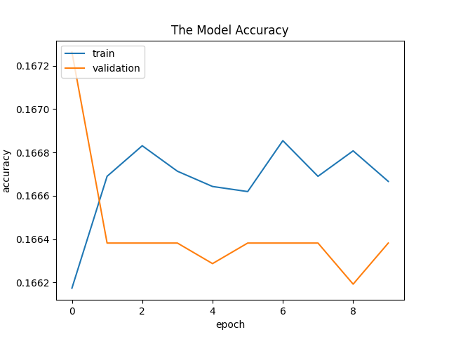

[//]: # (Image References)
[image_0]: ./misc/main_image.gif
# Behaviorial Cloning Project
![alt text][image_0] 


## Overview

The project is to learn more about Deep Neural Networks and Convolutional Neural Networks to clone driving behavior. A model is train, validate and test using Keras Framework.
 
The model outputs steering angles to an autonomous vehicle. A Simulator is provided from Udacity, where one can steer the car around a track for data collection. Image data and steering angles are used to train a neural network and then use to drive the car autonomously around a track.

## Goals and Steps

The goals / steps of this project are the following:
* Use the simulator to collect data of good driving behavior
* Build, a convolution neural network in Keras that predicts steering angles from images
* Train and validate the model with a training and validation set
* Test that the model successfully drives around track one without leaving the road

## Project Files
The project includes the following files:
* model.py containing the script to create and train the model
* drive.py for driving the car in autonomous mode
* model.h5 containing a trained convolution neural network 

## Model Architecture and Training Strategy
The model is based on the [Nvidia Architecture](http://images.nvidia.com/content/tegra/automotive/images/2016/solutions/pdf/end-to-end-dl-using-px.pdf).
It compose of 3 pre-processing steps, 5 Convolution layer, 1 flatten and 5 Fully Connected layers with 1 Dropout layer in the middle.

### Pre-Processing
The images went through 3 pre-processing steps before going to the Convolution layers. The steps are as follow:
1. Cropping-by removing the unwanted top and bottom parts of each images. There are not needed. 
2. Normalize-by making the images to be between -1 and 1.
3. Max Pooling-by reducing the images size by half the width and half the height.

### Model Table Summary 
Below is the table summary of the model:


The summary can be print on the console by creating the model and running:
```python
# model is the create model object
print(model.summary())
``

###### Model Creation Function
```python
# Input shape

ch, row, col = 3, 160, 320

def create_model(row, col, ch):

    model = Sequential()

    # Crop out the top and bottom parts of the image
    model.add(Cropping2D(cropping=((50, 20), (0, 0)), input_shape=(row, col, ch)))

    # Preprocess incoming data, centered around zero with small standard deviation
    model.add(Lambda(lambda x: (x / 127.5) - 1.0))

    # Reduce the image size by half by using Max Pooling
    model.add(MaxPooling2D((2, 2)))

    # Add 5 Convolution Layers
    model.add(Convolution2D(24, (5, 5), strides=2))
    model.add(Convolution2D(36, (5, 5), strides=2))
    model.add(Convolution2D(48, (5, 5), strides=1))
    model.add(Convolution2D(64, (3, 3), strides=1))
    model.add(Convolution2D(64, (3, 3), strides=1))

    # Flatten
    model.add(Flatten())

    # Add  5 Fully Connected Layers, with 1 Dropout layer
    model.add(Dense(1000))
    model.add(Activation('relu'))
    model.add(Dropout(0.5))
    model.add(Dense(200))
    model.add(Activation('relu'))
    model.add(Dense(50))
    model.add(Dense(10))
    model.add(Dense(1))

    # Compile with Adam Optimizer
    model.compile(loss='mse', optimizer='adam', metrics=['accuracy'])

    return model

```

### Model Hyperparameters
The model hyperparameters are:
* The Epoch is 10
* The Batch size is 128
* The learning rate is 0.5
* The Optimizer is the Adam Optimizer

#### Epoch
To tell the network how long we want it to train, we set an epoch number.An epoch is one trip through the entire 
training dataset. For this project, the training epochs} is set to 10.

#### Batch size
The Batch size is the number of training data in one forward/backward pass. It is the number of sample that is propagated
through the network. For this project the batch size is set to 128.The networks trains faster and update the weights after each mini-batches.
#### Learning rate
The learning rate has to do with how quickly the network abandons old beliefs for new ones.With a higher 
Learning Rate, the network  will changes its mind more quickly which is why a low learning rate of 0.001 is chosen for this model.

#### Adam Optimizer
Adam is an optimization algorithm that is use to update the weights iteratively based of the training data.

### Creation of the Training Set & Training Process
To collect as much data as possible I drove the car around the track for a total of 10 laps. After collecting the data/myData the following information is created
under data
1. `IMG folder` - this folder contains all driving frames. 5 images are added for demo purposes to [data/myData/IMG](./data/myData/IMG). The folder is to big to add all the images.
2. `driving_log.csv` - each row in this sheet correlates the image with the steering angle, throttle, brake and speed of the car.

#### Driving Log Table


### Simulator Capturing data
Below is an image on how the Simulator captures data and then creates the `IMG folder` and `driving_log.csv`.


### To make the Turns
To make the turns a fix bias of +0.35 is added to the steering angle for the left camera images and a -.35 is added for the right camera images.
For the middle camera images with center angle less then 0.15  are duplicated 10 times and center angle greater then 0.15 are duplicated 4 times to emphasis large steering data.

###### Collecting left camera images with steering angles, code snapshot
```python
def collect_left_camera_images_with_steering_angles(data_array, image_data, center_angle, line):
    left_name = image_data + line[1].split('/')[-1]
    left_angle = center_angle + 0.35
    left_line = [left_name, left_angle]
    data_array.append(left_line)
    return data_array
    
```


###### Collecting right camera images with steering angles, code snapshot
```python
def collect_right_camera_images_with_steering_angles(data_array, image_data, center_angle, line):
    right_name = image_data + line[2].split('/')[-1]
    right_angle = center_angle - 0.35
    right_line = [right_name, right_angle]
    data_array.append(right_line)
    return data_array
```

###### Collecting and  duplicating middle camera images with steering angles, code snapshot
```python
def collect_and_duplicate_mid_camera_images_with_steering_angles(data_array, center_angle, next_line):
    if center_angle < -0.15:
        for i in range(10):
            data_array.append(next_line)
    if center_angle > 0.15:
        for i in range(4):
            data_array.append(next_line)
    return data_array
```
#### Model Result
The able is able to drive the car around the track without leaving the road. Below is the model training and validation
 accuracy, loss graphs and youtube video:
 
 
 
 ###### Youtube Video
 Click on the image to start the video
[](https://www.youtube.com/watch?v=R0iOby1ZTRY)

### Dependencies
This lab requires:

* [CarND Term1 Starter Kit](https://github.com/udacity/CarND-Term1-Starter-Kit)

The lab environment can be created with CarND Term1 Starter Kit. Click [here](https://github.com/udacity/CarND-Term1-Starter-Kit/blob/master/README.md) for the details.


## Details About Files In This Directory

### `drive.py`

Usage of `drive.py` requires that the trained model is saved as an h5 file, i.e. `model.h5`. See the [Keras documentation](https://keras.io/getting-started/faq/#how-can-i-save-a-keras-model) for how to create this file using the following command:

```sh
model.save(filepath)
```

Once the model has been saved, it can be used with drive.py using this command:

```sh
python drive.py model.h5
```

The above command will load the trained model and use the model to make predictions on individual images in real-time and send the predicted angle back to the server via a websocket connection.

Note: There is known local system's setting issue with replacing "," with "." when using drive.py. When this happens it can make predicted steering values clipped to max/min values. If this occurs, a known fix for this is to add "export LANG=en_US.utf8" to the bashrc file.

#### Saving a video of the autonomous agent

```sh
python drive.py model.h5 run1
```

The fourth argument, `run1`, is the directory in which to save the images seen by the agent. If the directory already exists, it'll be overwritten.

```sh
ls run1

[2017-01-09 16:10:23 EST]  12KiB 2017_01_09_21_10_23_424.jpg
[2017-01-09 16:10:23 EST]  12KiB 2017_01_09_21_10_23_451.jpg
[2017-01-09 16:10:23 EST]  12KiB 2017_01_09_21_10_23_477.jpg
[2017-01-09 16:10:23 EST]  12KiB 2017_01_09_21_10_23_528.jpg
[2017-01-09 16:10:23 EST]  12KiB 2017_01_09_21_10_23_573.jpg
[2017-01-09 16:10:23 EST]  12KiB 2017_01_09_21_10_23_618.jpg
[2017-01-09 16:10:23 EST]  12KiB 2017_01_09_21_10_23_697.jpg
[2017-01-09 16:10:23 EST]  12KiB 2017_01_09_21_10_23_723.jpg
[2017-01-09 16:10:23 EST]  12KiB 2017_01_09_21_10_23_749.jpg
[2017-01-09 16:10:23 EST]  12KiB 2017_01_09_21_10_23_817.jpg
...
```

The image file name is a timestamp of when the image was seen. This information is used by `video.py` to create a chronological video of the agent driving.

### `video.py`

```sh
python video.py run1
```

Creates a video based on images found in the `run1` directory. The name of the video will be the name of the directory followed by `'.mp4'`, so, in this case the video will be `run1.mp4`.

Optionally, one can specify the FPS (frames per second) of the video:

```sh
python video.py run1 --fps 48
```

Will run the video at 48 FPS. The default FPS is 60.
